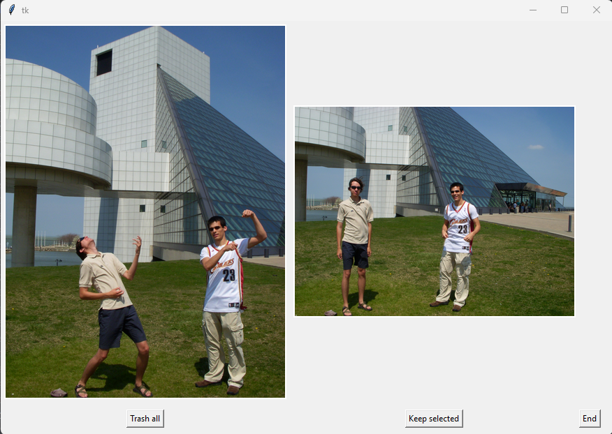
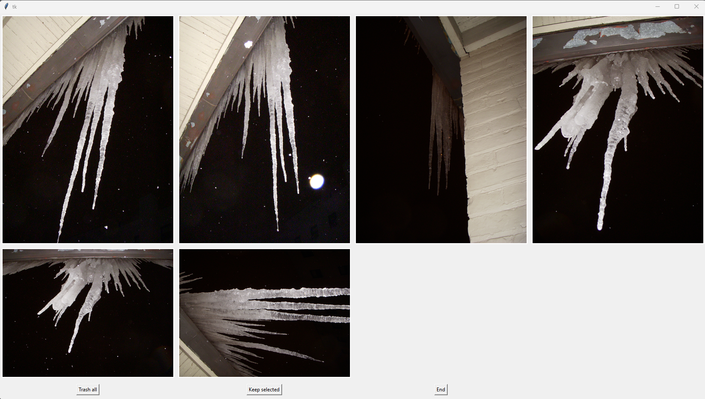

# AlbumReorganizer

## Description
AlbumReorganizer is a Python application designed to organize digital photo collections efficiently. It processes a directory of images, categorizing them based on metadata and user-defined criteria. The tool supports various image formats and includes a simple graphical interface for manual photo review.

I had the problem of taking lots of pictures of the same thing in a short span, and no way to quickly see which was the best. Also, all my pictures were in 40 different folders, completely unorganized.

I  needed code to 1. Sort my files by date, 2. Rename them to the date, and 3. Help me get rid of the duplicates.

Also, all videos are now in their own ```Videos``` Folder for each year, renamed by date/time taken.

# WARNING!

This code will rename all the files in the specified folder to the date/time at which they were taken. It does not make copies of the files itself. BE CAREFUL that you are ok with that.

I recommend making a copy of your files first and run this on the copy, perhaps on an external hard drive.

## Features
- **Automated Photo Sorting**: Sorts photos into folders based on their creation year.
- **EXIF Data Processing**: Utilizes EXIF data for organizing images.
- **Image Format Support**: Supports various image formats including JPG, PNG, BMP.
- **Graphical User Interface**: Provides a GUI for manual photo selection and grouping.
- **Customizable**: Easy to adapt and extend for various photo management needs.

## Installation

To set up AlbumReorganizer, follow these steps:

1. **Clone the Repository**:
   ```bash
   git clone https://github.com/aaronhadley/AlbumReorganizer.git
   cd AlbumReorganizer
   ```

2. **Install Dependencies**:

 Ensure that Python 3.x is installed on your system. Then install the required packages:

   ```bash
   pip install -r requirements.txt
   ```

## Usage

## It works in these easy steps:
### 1. Preparation: Uncomment ```step = 'prepare'``` in the main function then run main.py
   1. Goes to your specified 'OldPictures' folder and finds all photos, videos, and other files.
   2. Pulls their EXIF information, and uses the date to rename them to YYYYMMDD HHMMSS Format.
      1. Feel free to modify for your needs, underscore or whatnot.
   3. Moves them to a dated folder in the 'NewPictures' folder based on YYYY.
      1. Feel free to modify to YYYYMM if you so desire.
   4. Runs until there's an error or you're out of files.
      1. I have found I have to just run this portion a few times to get this part to go

### 2. Grouping: Uncomment ```step = 'group'``` in the main function then run main.py
   1. Goes through your NewPictures/YYYY folders
   2. Groups together pictures taken within ```threshold``` seconds of each other.
      1. This is to find times when you snapped 15 of the same objects
   3. Puts those clumps into new folders called NewPictures/YYYY/group-YYYYMMDD HHMMSS
      1. In the next step we will process these grouped folders with a GUI
      2. If you don't like the grouping, use the ```step='undogrouping'``` function

### 3. Review: Uncomment ```step = 'review'``` in the main function then run main.py.
   1. Iterates through the grouped folders and displays the pictures.
   2. Click the images you want to retain, then click 'Keep Selected'
   3. Or if you don't want any, "Trash All"
   4. If you need a break, hit "End" and the process will stop and allow you to pick back up there later.
   5. Kept pictures will be moved into the YYYY folder, removed files will stay in the folder
      1. The folder will be renamed with an ```x-``` at the front to prevent further review
      2. Delete these when the process is complete, or put them away, whatever suits you.





## Modules

- photo_processing.py: Handles the core functionality for processing individual photos.
- folder_processing.py: Manages processing of folders and grouping of images.
- gui.py: Contains the graphical user interface for manual photo review.
- main.py: The main script that ties together all functionalities.

## Configuration

Edit main.py to set the source and destination paths for your photos.
Here's variables you should change and my defaults:
- localPath = os.path.normpath('E:/OldPictures')
- destinationPath = 'E:/NewPictures'
- undoPath = 'E:/NewPictures/2009'  (for if you need to undo grouping)
- threshold = 5  (Finds photos taken within 5 seconds of each other, usually of the same thing)
- x = 0  (Set the position of the upper corner of the GUI during review)
- y = 0  (0,0 will be top left, negative goes up and left, positive goes down and right)

To change from YYYY to YYYYMM, in photo_processing.py
- destinationFolder = fileDate[:4]  ### Year only in file name, change to 6 for YYYYMM

## Contributing
Contributions to AlbumReorganizer are welcome!

If someone wants to get fancy, a photo similarity filter would be nice for grouping instead of time sequence as I used.

Also some algorithm that can automatically detect which portraits have people looking, ooh, or even combines them to make everyone looking at the camera.

I didn't get that fancy now, this is quick and dirty and works. And because of the manual analysis portion, you get to walk down memory lane. That was nice


## License
This project is licensed under the GNU General Public License - see the LICENSE file for details.

## Acknowledgments
To my friends and family, sorry I deleted so many pictures of you. To be fair, I took too many, which is what led to this problem


